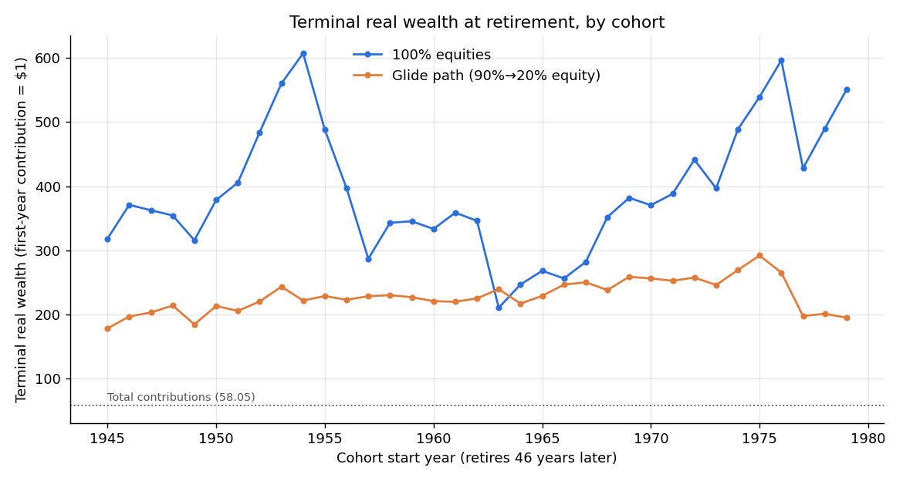
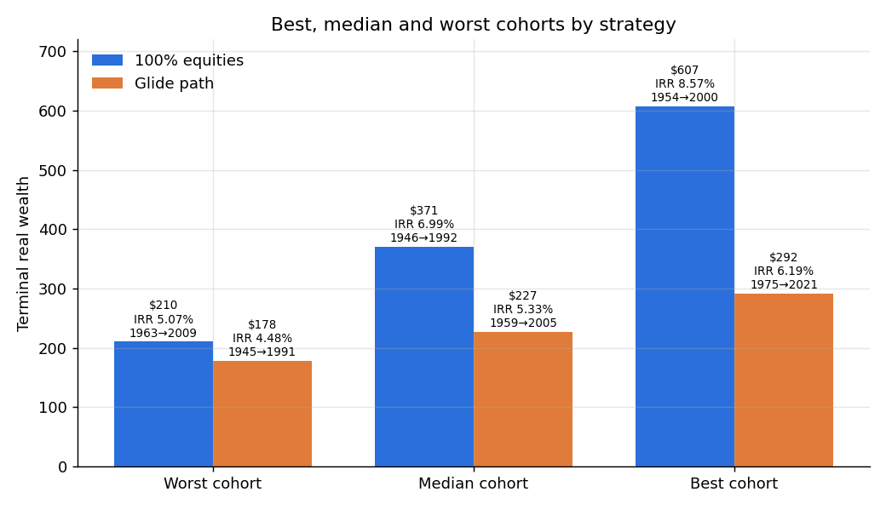
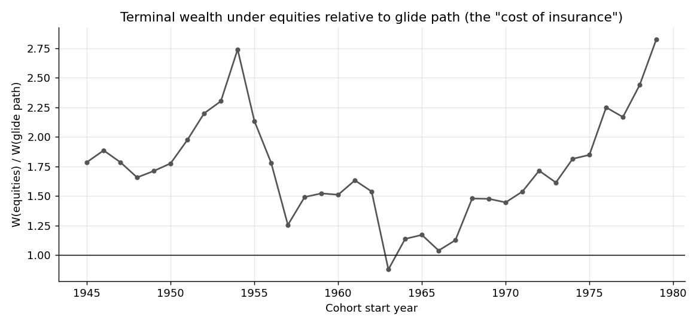
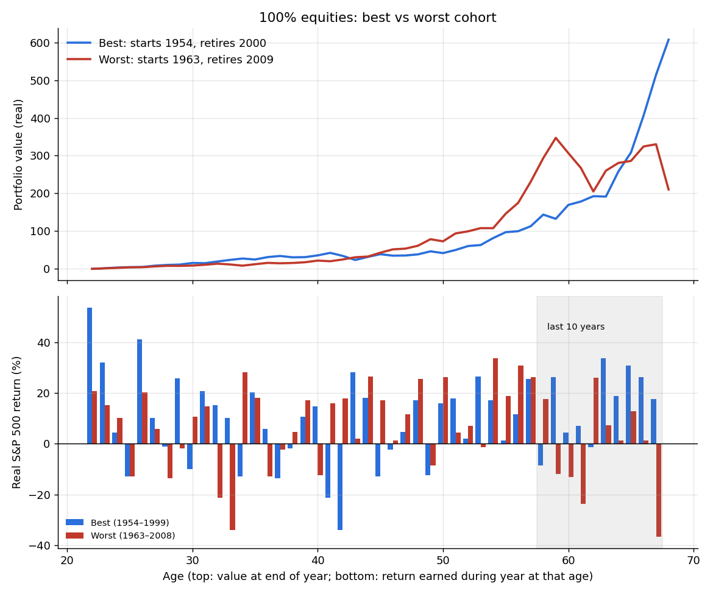
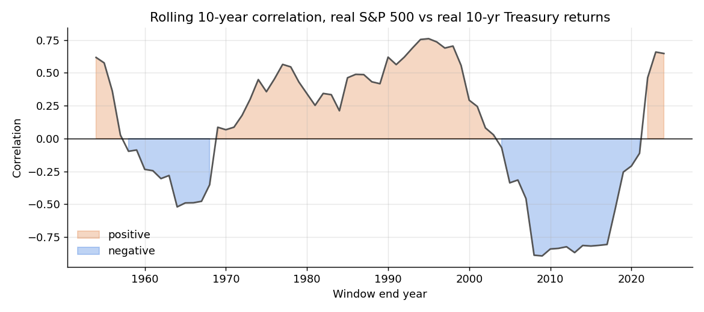

# Results: Sequencing Risk in Retirement Savings, 1945–2024

**Code:** [code/01_data.py](code/01_data.py) (data), [code/02_simulation.py](code/02_simulation.py) (Parts 2–3), [code/03_analysis.py](code/03_analysis.py) (Part 4). Raw console output is in `output/part*_log.txt`. Run the scripts in order from the repo root.

## Conventions
- **Data:** Damodaran `histretSP` gives nominal S&P 500 total return and nominal US 10-year T-bond return. Inflation is FRED `CPIAUCNS` (CPI-U, not seasonally adjusted).
- **Inflation:** measured **December to December**, so it covers the same 12 months as the calendar-year returns. Real return = (1+r)/(1+π) − 1. (Annual-average CPI was also computed and is saved in `data/returns_1945_2024_both_cpi_defs.csv`.)
- **Timing:** each contribution is made at the **start** of the year and earns that full year's return: Wk+1 = (Wk + ck)(1 + rk). Terminal wealth is measured at the end of working year 45 (age 67), which is the retirement date at 68.
- **Units:** all values are real, measured in the cohort's first-year dollars. The first contribution is $1, so total contributions are 58.05.
- **IRR:** the g that solves Σ ck(1+g)46−k = W46, found with `scipy.optimize.brentq`.

## Checkpoint 1: data ✅
| | Value |
|---|---|
| Years per series | 80 (S&P, T-bond, CPI) |
| Geometric mean real S&P 500 | **7.53%** (within the 6.5–8.5% range) |
| Geometric mean real 10-yr T-bond | **1.07%** |
| Worst real S&P year | 2008, −36.61% |
| Worst real bond year | 2022, −22.81% |
| 2008 real S&P | −36.61% ✅ (target ≈ −36%) |
| 2022 real S&P | −23.01% ⚠️ (target ≈ −24.5%) |

*Note:* no single inflation measure passes both spot checks. The −24.5% target for 2022 assumes annual-average CPI (8.0%), which gives −24.11%, but that measure also gives −38.90% for 2008. Dec/Dec was chosen and confirmed by the user.

## Checkpoint 2: model ✅
- Equity weight α: age 22 = **90.00%**, age 45 = **54.22%**, age 68 = **20.00%**. (The last allocation year is k = 45, at age 67.)
- Total real contributions Σ 1.01k = **58.0459**.
- Hand check, 1945 cohort, 100% equities:
  - 1945: (0 + 1.000000) × 1.328349 = 1.328349
  - 1946: (1.328349 + 1.010000) × (1 − 0.224849) = 1.812573
  - 1947: (1.812573 + 1.020100) × (1 − 0.033419) = 2.738009
  - All three match the simulation. Terminal wealth for this cohort is 318.

## Checkpoint 3: cohorts ✅
**35 cohorts.** The first starts in 1945, uses returns for 1945–1990, and retires in 1991. The last starts in 1979, uses returns for 1979–2024, and retires in 2025. (Start years run from 1945 to 2024 − 45 = 1979, and 1979 − 1945 + 1 = 35.)

| Start | Retire | W equities | W glide | IRR eq | IRR glide | W/C eq | W/C glide |
|---|---|---|---|---|---|---|---|
| 1945 | 1991 | 318 | 178 | 6.48% | 4.48% | 5.48 | 3.07 |
| 1946 | 1992 | 371 | 197 | 6.99% | 4.83% | 6.39 | 3.39 |
| 1947 | 1993 | 362 | 203 | 6.91% | 4.94% | 6.24 | 3.50 |
| 1948 | 1994 | 354 | 214 | 6.84% | 5.13% | 6.10 | 3.68 |
| 1949 | 1995 | 316 | 184 | 6.45% | 4.61% | 5.44 | 3.18 |
| 1950 | 1996 | 378 | 213 | 7.05% | 5.11% | 6.52 | 3.67 |
| 1951 | 1997 | 406 | 205 | 7.28% | 4.99% | 6.99 | 3.54 |
| 1952 | 1998 | 484 | 220 | 7.85% | 5.23% | 8.34 | 3.79 |
| 1953 | 1999 | 560 | 243 | 8.31% | 5.57% | 9.65 | 4.19 |
| 1954 | 2000 | 607 | 222 | 8.57% | 5.25% | 10.46 | 3.82 |
| 1955 | 2001 | 488 | 229 | 7.87% | 5.36% | 8.41 | 3.94 |
| 1956 | 2002 | 397 | 223 | 7.21% | 5.27% | 6.84 | 3.84 |
| 1957 | 2003 | 287 | 228 | 6.13% | 5.36% | 4.94 | 3.93 |
| 1958 | 2004 | 343 | 230 | 6.73% | 5.38% | 5.91 | 3.96 |
| 1959 | 2005 | 345 | 227 | 6.75% | 5.33% | 5.95 | 3.91 |
| 1960 | 2006 | 333 | 221 | 6.63% | 5.24% | 5.74 | 3.80 |
| 1961 | 2007 | 359 | 220 | 6.88% | 5.22% | 6.18 | 3.78 |
| 1962 | 2008 | 346 | 225 | 6.76% | 5.30% | 5.96 | 3.87 |
| 1963 | 2009 | 210 | 239 | 5.07% | 5.52% | 3.62 | 4.12 |
| 1964 | 2010 | 247 | 217 | 5.62% | 5.18% | 4.25 | 3.73 |
| 1965 | 2011 | 268 | 229 | 5.90% | 5.36% | 4.62 | 3.94 |
| 1966 | 2012 | 256 | 246 | 5.75% | 5.62% | 4.41 | 4.25 |
| 1967 | 2013 | 282 | 250 | 6.07% | 5.67% | 4.85 | 4.31 |
| 1968 | 2014 | 352 | 238 | 6.81% | 5.50% | 6.06 | 4.10 |
| 1969 | 2015 | 382 | 259 | 7.08% | 5.78% | 6.58 | 4.46 |
| 1970 | 2016 | 370 | 256 | 6.98% | 5.75% | 6.38 | 4.41 |
| 1971 | 2017 | 388 | 252 | 7.13% | 5.70% | 6.69 | 4.35 |
| 1972 | 2018 | 441 | 257 | 7.55% | 5.77% | 7.60 | 4.43 |
| 1973 | 2019 | 397 | 246 | 7.20% | 5.61% | 6.83 | 4.23 |
| 1974 | 2020 | 489 | 269 | 7.88% | 5.92% | 8.42 | 4.64 |
| 1975 | 2021 | 540 | 292 | 8.20% | 6.19% | 9.29 | 5.03 |
| 1976 | 2022 | 597 | 265 | 8.51% | 5.87% | 10.28 | 4.57 |
| 1977 | 2023 | 428 | 197 | 7.45% | 4.85% | 7.37 | 3.40 |
| 1978 | 2024 | 490 | 201 | 7.89% | 4.91% | 8.44 | 3.46 |
| 1979 | 2025 | 551 | 195 | 8.26% | 4.80% | 9.49 | 3.36 |

| | Equities | Glide path |
|---|---|---|
| Best | 1954→2000: **607**, IRR 8.57% | 1975→2021: **292**, IRR 6.19% |
| Worst | 1963→2009: **210**, IRR 5.07% | 1945→1991: **178**, IRR 4.48% |
| Best / worst | **2.89×** | **1.64×** |
| Median | **371** (IRR 6.99%, 1946 cohort) | **227** (IRR 5.33%, 1959 cohort) |

## Part 4: analysis

Equities beat the glide path for 34 of the 35 cohorts. The ratio of equity to glide-path wealth has a median of 1.71 and ranges from 0.88 (the 1963 cohort, the only one where the glide path won) to 2.83 (the 1979 cohort).

### 4.2 Decomposition

Under 100% equities, the worst cohort (1963) was **ahead** of the best cohort (1954) through age 64 and was overtaken only in the final four years. At age 58 it held 294 against the best cohort's 144. After that, the worst cohort's last 10 years averaged −1.92% real, ending with 2008 at −36.6%. The best cohort's last 10 years (1990–1999) averaged +15.53% real.

### 4.3 Early- vs late-career returns (35 overlapping cohorts)
| Terminal wealth vs average real equity return in… | corr | R² |
|---|---|---|
| Equities, first 10 years | +0.28 | 0.08 |
| Equities, **last 10 years** | **+0.76** | **0.58** |
| Glide path, first 10 years | −0.59 | 0.35 |
| Glide path, last 10 years | −0.11 | 0.01 |

For the glide path, the equity-return windows mainly reflect *which historical period* a cohort lived through, not how it was exposed. Glide-path wealth tracks the **career-average real bond return** instead (corr +0.77). Cohorts starting in the 1940s–50s had strong early equity returns, but the 1970s–early-80s bond losses hit them mid-career, when bonds made up a large share of the portfolio. Only 35 cohorts exist and they overlap heavily (neighboring cohorts share 45 of 46 years), so these correlations are descriptive, not independent evidence.

### 4.4 Bond risk
- Real 10-year Treasury returns were **negative in 38 of 80 years** (47.5%).
- The worst real bond year was **2022, at −22.81%**.
- In 2022, the real S&P 500 returned −23.01% and real 10-year Treasuries −22.81%. **Both fell together.** Stocks and bonds were both negative in real terms in 12 years: 1946, 1947, 1966, 1969, 1973, 1974, 1977, 1978, 1981, 1994, 2018 and 2022.
- **Rolling 10-year stock–bond correlation:** of the 71 windows, **42 are positive and 29 negative**. The range is −0.89 (window ending 2009) to +0.76 (window ending 1995). The full-sample correlation is +0.14.

## Checkpoint 4 ✅
- **Best equity cohort (1954) retires in 2000.** Its last five return years (1995–1999) were +33.8%, +18.7%, +30.9%, +26.3% and +17.7% real. ✅
- **Worst equity cohort (1963) retires in 2009.** Its final return year was 2008, at −36.6% real. ✅
- **The glide path narrows the best/worst ratio**, from 2.89 to 1.64. ✅
- **The glide path median is lower**, 227 against 371 for equities. ✅
- **2022 was negative for both stocks and bonds**, at −23.01% and −22.81% real. ✅

## Part 5: summary of findings
**1. Dispersion under pure equities.** Across 35 cohorts, each contributing the same real schedule (58.05 in total), terminal real wealth ranged from 210 to 607. That is a factor of 2.89, with money-weighted real returns from 5.07% to 8.57%. The median was 371. Dispersion depends heavily on returns near retirement. The average equity return in the last 10 working years explains 58% of the cross-cohort variation in terminal wealth, against 8% for the first 10 years. The worst cohort (1963–2008) led the best cohort (1954–1999) at age 58 and finished at about one-third of its wealth, mostly because of 2008.

**2. Does the glide path reduce dispersion?** Yes. The best-to-worst ratio falls to 1.64 (178 to 292), and the IRR range narrows to 4.48%–6.19%. The cost is large. Median terminal wealth is 227 against 371, about 39% lower. Pure equities ended with more wealth than the glide path for 34 of 35 cohorts, typically about 1.7 times as much. The only exception was the 1963 cohort, and even there the glide path's advantage was only 14%. The glide path's worst outcome (178) is below the equity strategy's worst (210). So in this sample, the glide path cut *relative* dispersion but did not raise the floor.

**3. How safe are bonds in real terms?** Not very. The real geometric mean return on 10-year Treasuries was 1.07% a year, compared with 7.53% for equities. Real bond returns were negative in 38 of 80 years. The worst year, 2022 (−22.81%), was almost as bad as the S&P 500's −23.01% that same year. Stocks and bonds were both negative in real terms in 12 years. The rolling 10-year stock–bond correlation was positive in 42 of 71 windows, so diversification between them was unreliable over long stretches. Glide-path outcomes depended mostly on career-average real bond returns (correlation 0.77). The weakest glide-path cohorts were those exposed to the 1970s inflation and bond losses, or to 2022 near retirement (1977–1979 cohorts).

**4. The role of birth year.** Two workers with identical saving behavior and identical strategies could end with terminal wealth differing by a factor of nearly 3 (pure equities) or 1.6 (glide path), depending only on when they started working. Which cohorts came out best or worst also depended on the strategy. The best equity cohort retired at the 2000 peak, while the best glide-path cohort retired in 2021. These results come from one historical path with 35 heavily overlapping cohorts, so they describe what happened, not the range of what could happen.
