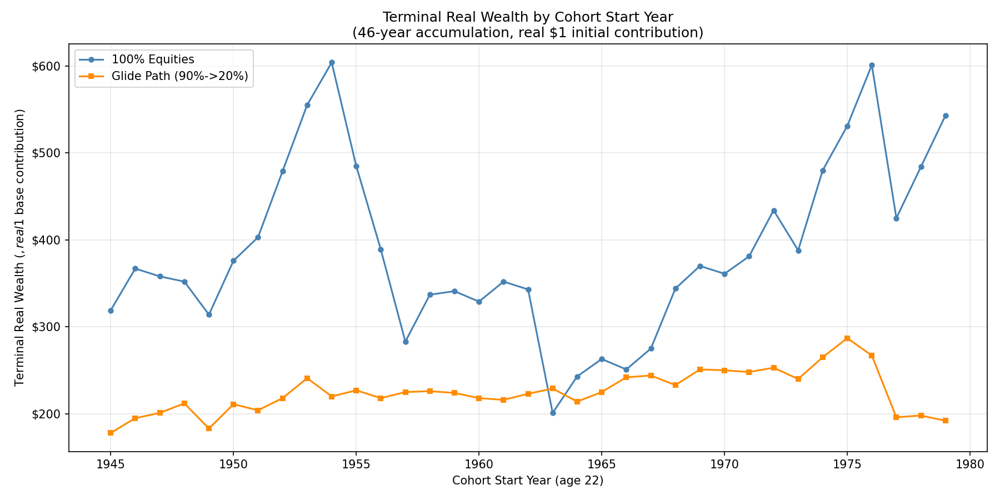

## Planning phase on claude.ai

https://claude.ai/chat/e000f432-d5e4-45fb-9729-8d853ebc027f

Key bit: "Design a prompt I can give to an LLM, to replicate this analysis. Use all the best practices about guidance on checkpoints and verification, and breaking the problem into pieces. Include other best practices as well. Don’t include in the prompt the conclusion the author arrives at."

## Live journaling

I opened VS Code. Opened Claude Code. 

This is Sonnet 4.5. Old model. (Cheaper, faster)

Prompt: 
> "The readme file contains an analysis plan. The Claude.md file has a few notes about working on this computer. Please execute the research. Ask questions as needed, and ensure the checkpoints are satisfied before proceeding."

Yuck: It appears to be trying to one-shot the whole damn thing. Maybe I should have told it to work piece by piece?

This dumbass wrote 300 lines of code to get the Demodoran data? Lol. It didn't work.

It's trying to fix things... let's see how it does.

Well, DAMN. 

Its output:

[The blue line above looks like what Jesus](https://x.com/jesusferna7026/status/2023742455204520249?s=12) posted:

